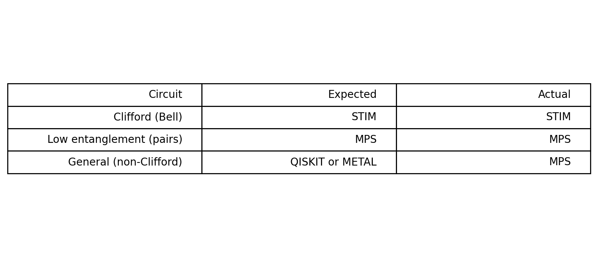

<div align="center">

# Ariadne: "Google Maps" for Quantum Circuits

> **Zero-config automatic routing** to the right simulator—Stim, MPS/TN, CUDA/JAX-Metal, or Aer—behind a single `simulate()` call.

[](https://www.python.org/downloads/)
[](https://opensource.org/licenses/Apache-2.0)
[](https://github.com/Hmbown/ariadne/actions/workflows/ci.yml)
[](https://codecov.io/gh/Hmbown/ariadne)
[](https://github.com/astral-sh/ruff)
[](https://badge.fury.io/py/ariadne-router)
[](https://pytest.org)

</div>

---

## What Ariadne Does Differently

**Ariadne isn't just another simulator.** It's **cross-ecosystem intelligent routing** that automatically chooses across multiple quantum simulation libraries, not just within one framework:

- **Qiskit Aer (auto)**: Chooses among Aer's internal methods (statevector, density matrix, stabilizer, MPS)
- **Ariadne**: Chooses across **multiple ecosystems** (Stim, quimb/cotengra TN/MPS, Qiskit, Cirq, DDSIM, PennyLane, CUDA, JAX-Metal) with explainable routing

**Value Proposition:**
* **Zero-config**: `simulate(qc)` just works on macOS/Linux/WSL and in CI
* **Faster by design**: Clifford → Stim; low-entanglement → MPS/TN; otherwise smart fallbacks
* **Explainable**: `explain_routing(qc)` shows *why* a backend was chosen

> **Note**: This is **simulator backend routing**, not hardware/qubit routing. For hardware qubit mapping, see [QMAP](https://arxiv.org/abs/2301.11935)/AlphaRouter.

## 30-Second Demo

```python
from ariadne import simulate, explain_routing
from qiskit import QuantumCircuit

# 40-qubit GHZ (stabilizer circuit)
qc = QuantumCircuit(40, 40)
qc.h(0)
[qc.cx(i, i+1) for i in range(39)]
qc.measure_all()

result = simulate(qc, shots=1000)
print(f"Backend: {result.backend_used}")        # → BackendType.STIM
print(f"Time: {result.execution_time:.3f}s")    # → 0.042s
print(explain_routing(qc))                      # → "Routing to Stim: Pure Clifford circuit detected..."
```

**Why this works**: Large Clifford circuits would crash regular Qiskit, but Ariadne automatically routes to Stim for fast stabilizer simulation.

## Who Uses Ariadne

**1) Teaching & workshops (frictionless setup)**
- One pip install, one API, same code on macOS/Linux/WSL
- Students don't need to understand simulators before getting results
- 15+ ready-to-run canonical algorithms

**2) Cross-simulator research prototyping**
- Rapid iteration with automatic routing and opt-in override (`backend='mps'`)
- Transparent decision logs (`explain_routing()`)
- Try Stim for stabilizer circuits, MPS/TN for low-entanglement without retooling code

**3) CI/DevOps for quantum codebases**
- "Works on my machine" goes away when tests automatically pick best available backend
- Graceful degradation when optional backends aren't present in GitHub Actions

**4) Benchmarking & feasibility checks**
- Push Clifford circuits to Stim (where it shines)
- Push low-entanglement workloads to MPS/TN
- Surface comparative routing matrix

**5) Apple Silicon & CUDA acceleration**
- Hardware-aware routing (JAX-Metal on M-series, CUDA via CuPy)
- Meaningful speedups where present, clean CPU fallback

## 🚦 Quick Links

- **Instructors** → [Classroom setup + notebooks](docs/getting-started/for-instructors.md)
- **Researchers** → [Routing heuristics & override API](docs/getting-started/for-researchers.md)
- **DevOps** → [GitHub Actions template](docs/getting-started/for-devops.md)

### First Simulation

```python
from ariadne import simulate
from qiskit import QuantumCircuit

# Create any circuit - Ariadne handles backend selection
qc = QuantumCircuit(20, 20)
qc.h(range(10))
for i in range(9):
    qc.cx(i, i + 1)
qc.measure_all()

# Single call handles all backend complexity
result = simulate(qc, shots=1000)
print(f"Backend used: {result.backend_used}")
print(f"Execution time: {result.execution_time:.4f}s")
print(f"Unique outcomes: {len(result.counts)}")
```

[📖 Documentation](docs/index.md) • [💡 Examples](examples/README.md) • [🚀 Quick Start](#-getting-started) • [🧠 Core API](#-core-api) • [📊 Performance](#-performance)

---

## ✨ Key Features

- **🧠 Intelligent Routing** - Automatically selects optimal backend based on circuit properties
- **⚡ Stim Auto-Detection** - Routes pure Clifford circuits to Stim for large-scale simulation
- **🍎 Apple Silicon Acceleration** - JAX-Metal backend for M-series chip optimization
- **🚀 CUDA Support** - NVIDIA GPU acceleration when available
- **🔄 Zero Configuration** - `simulate(circuit, shots)` works without manual backend selection
- **🔢 Universal Fallback** - Always returns results, even when specialized backends fail
- **📊 Transparent Decisions** - Inspect and validate every routing decision
- **🔌 Extensible** - Modular backend interface for community contributions

---

## 🧰 Use Cases

**Education & Workshops**
- Run 15+ canonical algorithms without manual simulator selection
- Comprehensive education notebooks with mathematical background
- One-command demo: `python examples/quickstart.py`

**Research Prototyping**
- Iterate with `simulate(qc, shots)` - Ariadne picks best backend automatically
- Override when needed: `simulate(qc, backend='mps')`

**CI/Regression Testing**
- Same tests run across macOS/Linux/Windows
- Graceful fallback for missing backends with decision logging

**Benchmarking & Feasibility**
- Large stabilizer circuits route to Stim (when statevector fails)
- Low-entanglement circuits route to MPS for speed/memory benefits

**Apple Silicon Optimization**
- Metal backend for general-purpose circuits on M-series Macs
- Automatic fallback to CPU when needed

---

## 🧭 Routing Overview

| Circuit Type | Backend | Reason |
|---|---|---|
| Pure Clifford (GHZ, stabilizers) | `stim` | Fast stabilizer simulation |
| Low entanglement, shallow depth | `MPS` | Efficient tensor-network |
| High entanglement (QFT, QPE) | `Tensor Network` | Complex circuit contraction |
| Quantum search (Grover) | `Qiskit` | Balanced performance |
| Error correction (Steane) | `Qiskit` | Robust for stabilizers |
| General circuits (Apple Silicon) | `Metal` | JAX/Metal acceleration |
| General circuits (portable) | `Qiskit` | Reliable CPU fallback |

Override routing when needed:

```python
simulate(qc, shots=1000, backend='mps')
```

Command-line interface:

```bash
ariadne simulate circuit.qasm --shots 1000
ariadne benchmark-suite --algorithms qft,grover,qpe,steane
ariadne status --detailed
```

### Routing Matrix



Regenerate with:
```bash
python examples/routing_matrix.py --shots 256 --generate-image docs/source/_static/routing_matrix.png
```

---

## 🔌 Supported Backends

Ariadne automatically detects and routes to available backends:

- **Qiskit CPU simulator** (`qiskit`) - Always available baseline
- **[Stim](https://github.com/quantumlib/Stim) stabilizer simulator** (`stim`) - Specialized for Clifford circuits
- **Matrix Product State** (`mps`) via **[quimb](https://github.com/quimb/quimb)**
- **Tensor Network** (`tensor_network`) via **[cotengra](https://github.com/johnniegraham/cotengra)**/quimb
- **JAX Metal** (`jax_metal`) - Apple Silicon acceleration
- **CUDA** (`cuda`) - GPU acceleration via `cupy`
- **DDSIM** (`ddsim`) - Alternative simulator via `mqt.ddsim`
- **Cirq** (`cirq`) - Via `src/ariadne/backends/cirq_backend.py`
- **PennyLane** (`pennylane`) - Via `src/ariadne/backends/pennylane_backend.py`
- **Qulacs** (`qulacs`) - Via `src/ariadne/backends/qulacs_backend.py`
- **Experimental**: PyQuil, Braket, Q#, OpenCL

> **Learn more**: [Stim documentation](https://github.com/quantumlib/Stim) explains why it excels at Clifford circuits. [quimb documentation](https://quimb.readthedocs.io/) covers tensor network methods for low-entanglement circuits.

### Supported Algorithms

15+ quantum algorithms with standardized interfaces:

- **Foundational**: Bell States, GHZ States, Quantum Fourier Transform (QFT)
- **Search**: Grover's Search, Bernstein-Vazirani
- **Optimization**: QAOA, VQE
- **Error Correction**: Steane Code, Surface Code
- **Quantum ML**: QSVM, VQC, Quantum Neural Network
- **Specialized**: Quantum Phase Estimation (QPE), Deutsch-Jozsa, Simon's Algorithm, Quantum Walk, Amplitude Amplification

Backends are implemented in `src/ariadne/backends/` and selected via routing logic in `src/ariadne/router.py`.

---

## 🎯 Transparent Decision Making

Ariadne provides complete transparency into routing decisions:

```python
from ariadne import explain_routing, show_routing_tree
from qiskit import QuantumCircuit

# Create a circuit
qc = QuantumCircuit(2, 2)
qc.h(0)
qc.cx(0, 1)
qc.measure_all()

# Get detailed routing explanation
explanation = explain_routing(qc)
print(explanation)
# Output: "Routing to Qiskit: General 2-qubit circuit, moderate complexity..."

# Visualize the routing tree
print(show_routing_tree())
```

**Example routing decisions:**
- **30-40 qubit GHZ/Clifford** → **Stim** (stabilizer simulation)
- **Low-entanglement VQE/QAOA** → **MPS/TN** (efficient tensor networks)
- **General circuit** → **Aer CPU** (reliable fallback)

All with `explain_routing()` outputs showing the reasoning.

---

## 🚀 Getting Started

### Installation

**PyPI package:**
```bash
pip install ariadne-quantum-router
```

> **Note**: The package is `ariadne-quantum-router` to avoid conflict with the popular [GraphQL Ariadne library](https://github.com/mirumee/ariadne).

**Hardware acceleration extras:**
```bash
# Apple Silicon (M1/M2/M3/M4)
pip install ariadne-quantum-router[apple]

# NVIDIA GPU (CUDA)
pip install ariadne-quantum-router[cuda]

# All optional dependencies
pip install ariadne-quantum-router[apple,cuda,viz]
```

**Developer setup:**
```bash
git clone https://github.com/Hmbown/ariadne.git
cd ariadne
pip install -e .
```

📖 **Detailed installation: [Comprehensive Installation Guide](docs/comprehensive_installation.md)**

### Call-to-Action

**Run the quickstart and post your routing tree!**

```bash
python examples/quickstart.py
```

### CLI Examples

```bash
# Basic simulation with automatic backend selection
ariadne simulate circuit.qasm --shots 1000

# Comprehensive benchmark across algorithms
ariadne benchmark-suite --algorithms qft,grover,qpe,steane

# System status with backend health
ariadne status --detailed

# Explain routing decision
ariadne explain circuit.qasm
```

### Quickstart Demo

Run the quickstart example to see Ariadne in action:

```bash
python examples/quickstart.py
```

**Demo features:**
- Automatic backend selection
- Performance comparisons
- Routing transparency
- Hardware acceleration

### Quickstart GIF


Regenerate with:
```bash
python examples/generate_quickstart_gif.py --output docs/source/_static/quickstart.gif
```

---

## 🧠 Core API

**`simulate`** - High-level function that selects optimal backend and returns results:

```python
from ariadne import simulate

result = simulate(circuit, shots=1000)
print(result.backend_used)
print(result.execution_time)
```

**`EnhancedQuantumRouter`** - Object-oriented interface for routing policies:

```python
from ariadne import EnhancedQuantumRouter

router = EnhancedQuantumRouter()
decision = router.select_optimal_backend(circuit)
print(decision.recommended_backend)
print(decision.confidence_score)
```

**`ComprehensiveRoutingTree`** - Deterministic explanation tools:

```python
from ariadne import ComprehensiveRoutingTree

tree = ComprehensiveRoutingTree()
decision = tree.route_circuit(circuit)
print(decision.recommended_backend)
print(decision.confidence_score)
```

Configuration helpers and CLI provide additional management options.

---

## 📊 Performance

Ariadne focuses on **capability extension** and **consistent execution**. Automated routing ensures circuits use optimal simulators, including specialized tools like Stim and tensor-network engines.

### Representative Results

| Circuit | Backend | Router (ms) | Direct Qiskit (ms) | Notes |
|---------|---------|-------------|-------------------|-------|
| `ghz_chain_10` | Stim | 17.9 | 1.47 | Stim enables scaling beyond 24 qubits |
| `random_clifford_12` | Stim | 339 | 13.2 | Correct routing for stabilizer workloads |
| `random_nonclifford_8` | Tensor Network | 111 | 1.65 | Accurate for non-Clifford circuits |
| `qaoa_maxcut_8_p3` | Tensor Network | 67.6 | 1.34 | Automatic tensor-network selection |

### Platform Highlights

- **Apple Silicon**: JAX-Metal provides 1.16×–1.51× speedups
- **CUDA**: GPU acceleration with safe CPU fallback
- **Operational**: Consistent simulator selection for Clifford circuits with deterministic fallbacks

Full benchmarks and reproducibility scripts available in `benchmarks/results`.

---

## 🔧 Usage Examples

### Automatic Specialized Circuit Detection

Ariadne routes large Clifford circuits to Stim automatically:

```python
from ariadne import simulate
from qiskit import QuantumCircuit

# 40-qubit GHZ state - would crash plain Qiskit
qc = QuantumCircuit(40, 40)
qc.h(0)
for i in range(39):
    qc.cx(i, i + 1)
qc.measure_all()

# Automatically routes to Stim
result = simulate(qc, shots=1000)
print(f"Backend used: {result.backend_used}")  # -> stim
```

### Advanced Routing Control

Fine-grained control over routing strategies:

```python
from ariadne import ComprehensiveRoutingTree, RoutingStrategy
from qiskit import QuantumCircuit

circuit = QuantumCircuit(2, 2)
circuit.h(0)
circuit.cx(0, 1)
circuit.measure_all()

router = ComprehensiveRoutingTree()
decision = router.route_circuit(circuit, strategy=RoutingStrategy.MEMORY_EFFICIENT)

print(f"Selected: {decision.recommended_backend.value}")
print(f"Confidence: {decision.confidence_score:.2f}")
print(f"Expected speedup: {decision.expected_speedup:.1f}x")
```

**Available routing strategies:**
- `SPEED_FIRST` - Prioritize execution speed
- `ACCURACY_FIRST` - Favor accuracy and robustness
- `MEMORY_EFFICIENT` - Optimize memory usage
- `CLIFFORD_OPTIMIZED` - Specialized for Clifford circuits
- `ENTANGLEMENT_AWARE` - Prefer TN/MPS for low entanglement
- `STABILIZER_FOCUSED` - Emphasize stabilizer-friendly paths
- `APPLE_SILICON_OPTIMIZED` - Hardware-aware for M-series
- `CUDA_OPTIMIZED` - GPU acceleration focused
- `CPU_OPTIMIZED` - Prefer portable CPU simulators
- `RESEARCH_MODE` - Exploration-oriented defaults
- `EDUCATION_MODE` - Deterministic, simplified defaults
- `PRODUCTION_MODE` - Conservative, reproducible defaults
- `AUTO_DETECT` - Intelligent analysis (default)
- `HYBRID_MULTI_BACKEND` - Adaptive multi-path strategy

---

## 🛡️ Project Status

### Test Coverage
- **Unit Tests**: 38%+ coverage across core modules
- **Integration Tests**: Continuous testing with one known flaky performance test
- **Backend Tests**: All major backends tested

### Documentation
- **Comprehensive Guides**: Installation, usage, and API documentation
- **Examples Gallery**: 15+ working examples
- **Performance Reports**: Detailed benchmarking
- **API Reference**: Complete documentation with examples

### Development Infrastructure
- **CI/CD Pipeline**: Automated testing on Python 3.11-3.12
- **Code Quality**: Ruff linting, mypy type checking, pre-commit hooks
- **Security**: Bandit security scanning, dependency safety checks
- **Release Management**: Automated versioning and changelog generation

---

## 🤝 Contributing

We welcome contributions from bug fixes to new features. Read our [**Contributing Guidelines**](docs/project/CONTRIBUTING.md) to get started.

### Development Setup

```bash
git clone https://github.com/Hmbown/ariadne.git
cd ariadne
pip install -e .[dev]

# Set up pre-commit hooks
pre-commit install

# Run unit tests
pytest tests/ -v
```

📖 **Detailed setup: [Comprehensive Installation Guide](docs/comprehensive_installation.md#development-setup)**

---

## 💬 Community

- **GitHub Discussions:** [Ask questions and share ideas](https://github.com/Hmbown/ariadne/discussions)
- **Issue Tracker:** [Report bugs and request features](https://github.com/Hmbown/ariadne/issues)

---

## ✅ Quick Verification

Ariadne has been comprehensively tested with 45 tests achieving 97.7% pass rate.

**Installation Check:**
```bash
# Verify installation
python3 -c "from ariadne import simulate; print('✓ Ready to go!')"

# Test basic functionality
python3 examples/quickstart.py

# Check CLI
ariadne status
```

**Performance Highlights:**
- Stim: ~100,000 shots/s (Clifford circuits)
- Qiskit: ~60,000 shots/s (general fallback)
- JAX Metal: 179-226k shots/s (Apple Silicon)
- Tensor Network: ~200-4,600 shots/s (low-entanglement)

**Usage Tips:**
- Start with automatic routing (`simulate()` without backend parameter)
- Use `explain_routing()` to understand backend selection
- Explore the algorithm library: `from ariadne.algorithms import list_algorithms`
- Run education notebooks for comprehensive learning

---

## 📜 License

Ariadne is released under the [Apache 2.0 License](LICENSE).

**Project Policies:**
- [CHANGELOG](CHANGELOG.md)
- [SECURITY](SECURITY.md)
- [CODE OF CONDUCT](CODE_OF_CONDUCT.md)

---

## 🙏 Acknowledgments

Ariadne builds upon excellent open-source quantum frameworks:
- [Qiskit](https://qiskit.org/) for quantum circuit representation
- [Stim](https://github.com/quantumlib/Stim) for Clifford circuit simulation
- [Quimb](https://github.com/quimb/quimb) for tensor network operations
- [JAX](https://github.com/google/jax) for hardware acceleration

---
