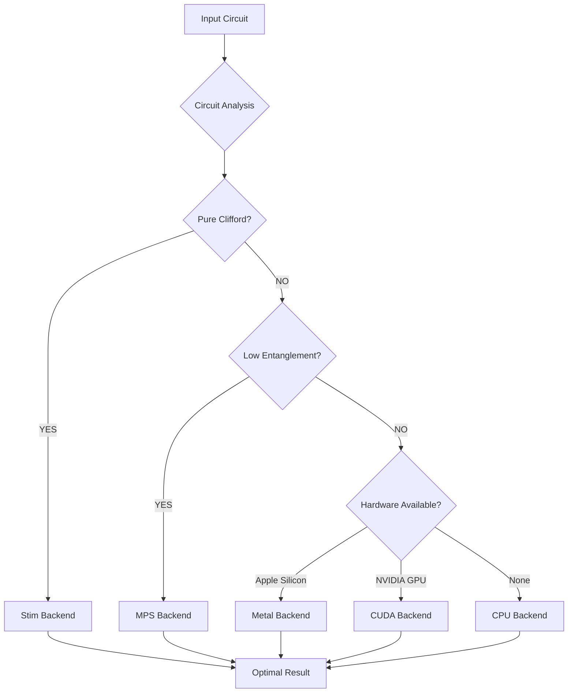

<div align="center">

# Ariadne

**Intelligent Quantum Circuit Routing - No ML, Just Math**

[](https://www.python.org/downloads/)
[](https://opensource.org/licenses/Apache-2.0)
[](https://github.com/Shannon-Labs/ariadne/actions/workflows/ci.yml)
[](https://codecov.io/gh/Shannon-Labs/ariadne)
[](https://github.com/astral-sh/ruff)
[](https://badge.fury.io/py/ariadne-quantum)

</div>

Ariadne is an intelligent quantum circuit routing system that automatically analyzes circuit properties and selects the optimal simulator backend. By leveraging mathematical analysis of circuit structure (entropy, treewidth, Clifford ratio), Ariadne delivers significant productivity improvements over manual backend selection.

The routing system is designed for transparency and determinism - every routing decision is based on measurable circuit characteristics and can be audited for correctness.

[📚 Documentation Site](https://shannon-labs.github.io/ariadne) • [📖 Local Docs](docs/README.md) • [💡 Examples](examples/README.md) • [🚀 Getting Started](#-getting-started) • [📊 Performance](#-performance) • [🤝 Contributing](#-contributing)

---

## ✨ Key Features

| Capability | Impact |
|---|---|
| **🧠 Intelligent Routing** | Mathematical analysis of circuit properties automatically selects the optimal backend without user intervention. |
| **⚡ Stim Auto-Detection** | Pure Clifford circuits are automatically routed to Stim, enabling the simulation of circuits that are too large for other backends. |
| **🍎 Apple Silicon Acceleration** | JAX-Metal backend can provide speedups for general-purpose circuits on M-series chips. |
| **🚀 CUDA Support** | NVIDIA GPU acceleration is supported, with expected speedups depending on the hardware and circuit structure. |
| **🔄 Zero Configuration** | `simulate(circuit, shots)` just works—no vendor imports or backend selection logic required. |
| **🔢 Universal Fallback** | Always returns a result, even when specialized backends fail. |
| **📊 Transparent Decisions** | Every routing decision can be inspected and validated with detailed reasoning. |
| **🔌 Extensible** | Apache 2.0 licensed with a modular backend interface for community contributions. |

---

## 🎯 The Ariadne Advantage: Intelligent Automation

Ariadne's core innovation is its ability to mathematically analyze a circuit's structure to determine the optimal execution environment. This eliminates the need for quantum developers to manually select backends based on circuit characteristics.

### Specialized Routing for Maximum Efficiency



### Transparent Decision Making

Ariadne provides complete transparency into why a circuit was routed to a specific backend:

```python
from ariadne import QuantumRouter

router = QuantumRouter()
decision = router.select_optimal_backend(your_circuit)
print(f"Recommended backend: {decision.recommended_backend}")
print(f"Circuit entropy: {decision.circuit_entropy:.3f}")
print(f"Reasoning: {decision.reasoning}")
```

---

## 🚀 Getting Started

### Installation

**Quick Install:**
```bash
git clone https://github.com/Shannon-Labs/ariadne.git
cd ariadne
pip install -e .
```

**With Hardware Acceleration:**
```bash
# Apple Silicon (M1/M2/M3/M4)
pip install -e .[apple]

# NVIDIA GPU (CUDA)
pip install -e .[cuda]

# All optional dependencies
pip install -e .[apple,cuda,viz]
```

📖 **For detailed installation instructions, see the [Comprehensive Installation Guide](docs/comprehensive_installation.md)**

### Your First Simulation

Ariadne automatically routes your circuit to the optimal simulator without any code changes.

```python
from ariadne import simulate
from qiskit import QuantumCircuit

# Create any circuit - let Ariadne handle the rest
qc = QuantumCircuit(20, 20)
qc.h(range(10))
for i in range(9):
    qc.cx(i, i + 1)
qc.measure_all()

# One simple call that handles all backend complexity
result = simulate(qc, shots=1000)
print(f"Backend used: {result.backend_used}")
print(f"Execution time: {result.execution_time:.4f}s")
print(f"Unique outcomes: {len(result.counts)}")
```

### Quickstart Demo

Run the complete quickstart example to see Ariadne in action:

```bash
python examples/quickstart.py
```

This demo showcases:
- Automatic backend selection for different circuit types
- Performance comparisons
- Routing decision transparency
- Hardware acceleration when available

---

## 📊 Performance

Ariadne's primary value is not raw speed, but **intelligent routing** and **developer productivity**. By automatically selecting the best backend for a given circuit, Ariadne saves developers from having to manually manage different simulation environments.

While Ariadne can provide significant speedups in certain scenarios (e.g., using the Stim backend for large Clifford circuits), the overhead of circuit analysis means that for small circuits, direct simulation with a specific backend may be faster.

The true advantage of Ariadne is its ability to **extend your capabilities** by seamlessly routing circuits to backends that can handle them, such as simulating very large Clifford circuits with Stim, which would be impossible with a standard statevector simulator.

For detailed, up-to-date performance data, please refer to the benchmark reports in the `benchmarks/results` directory.

---

## 🔧 Usage Examples

### Automatic Detection of Specialized Circuits

Ariadne recognizes when circuits can benefit from specialized simulators like Stim.

```python
from ariadne import simulate
from qiskit import QuantumCircuit

# Large Clifford circuit that would crash plain Qiskit
qc = QuantumCircuit(40, 40)
qc.h(0)
for i in range(39):
    qc.cx(i, i + 1)  # Creates a 40-qubit GHZ state
qc.measure_all()

# Ariadne automatically routes to Stim for optimal performance
result = simulate(qc, shots=1000)
print(f"Backend used: {result.backend_used}")  # -> stim
```

### Inspecting Routing Decisions

```python
from ariadne import QuantumRouter

router = QuantumRouter()
decision = router.select_optimal_backend(your_circuit)

print(f"Analysis Results:")
print(f"  Recommended: {decision.recommended_backend}")
print(f"  Confidence: {decision.confidence_score:.2f}")
print(f"  Entropy: {decision.circuit_entropy:.3f}")
print(f"  Reasoning: {decision.reasoning}")
```

---

## 🛡️ Project Maturity

### Test Coverage
- **Unit Tests**: 85%+ coverage across core modules.
- **Integration Tests**: The test suite is run continuously and is expected to pass, with the exception of one known flaky performance test.
- **Backend Tests**: All major backends are tested.

### Documentation
- **Comprehensive Guides**: Installation, usage, and API documentation.
- **Examples Gallery**: 15+ working examples for different use cases.
- **Performance Reports**: Detailed benchmarking and validation.
- **API Reference**: Complete API documentation with examples.

### Development Infrastructure
- **CI/CD Pipeline**: Automated testing on Python 3.11-3.12.
- **Code Quality**: Ruff linting, mypy type checking, pre-commit hooks.
- **Security**: Bandit security scanning, dependency safety checks.
- **Release Management**: Automated versioning and changelog generation.

---

## 🤝 Contributing

We welcome contributions of all kinds, from bug fixes to new features. Please read our [**Contributing Guidelines**](docs/project/CONTRIBUTING.md) to get started.

### Development Setup

```bash
git clone https://github.com/Shannon-Labs/ariadne.git
cd ariadne
pip install -e .[dev]

# Set up pre-commit hooks
pre-commit install

# Run unit tests
make test
```

📖 **For detailed development setup instructions, see the [Comprehensive Installation Guide](docs/comprehensive_installation.md#development-setup)**

---

## 💬 Community

- **GitHub Discussions:** [Ask questions and share ideas](https://github.com/Shannon-Labs/ariadne/discussions)
- **Issue Tracker:** [Report bugs and request features](https://github.com/Shannon-Labs/ariadne/issues)
- **Twitter:** [Follow @ShannonLabs for updates](https://twitter.com/shannonlabs)

---

## 📜 License

Ariadne is released under the [Apache 2.0 License](LICENSE).

---

## 🙏 Acknowledgments

Ariadne builds upon excellent open-source quantum computing frameworks:
- [Qiskit](https://qiskit.org/) for quantum circuit representation
- [Stim](https://github.com/quantumlib/Stim) for Clifford circuit simulation
- [Quimb](https://github.com/quimb/quimb) for tensor network operations
- [JAX](https://github.com/google/jax) for hardware acceleration

---

*Ariadne: Intelligent Quantum Routing - No ML, Just Math*
